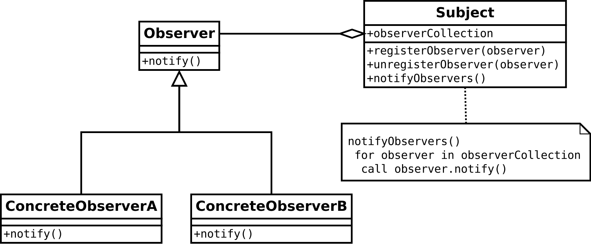

# Observer Pattern(옵저버 패턴)

The observer pattern is a software design pattern in which an object, called the subject, maintains a list of its dependents, called observers, and notifies them automatically of any state changes, usually by calling one of their methods.

It is mainly used to implement distributed event handling systems, in "event driven" software. In those systems, the subject is usually called a "stream of events" or "stream source of events", while the observers are called "sink of events". The stream nomenclature simulates or adapts to a physical setup where the observers are physically separated and have no control over the emitted events of the subject/stream-source. This pattern then perfectly suits any process where data arrives through I/O, that is, where data is not available to the CPU at startup, but can arrive "randomly" (HTTP requests, GPIO data, user input from keyboard/mouse/..., distributed databases and blockchains, ...). Most modern languages have built-in "event" constructs which implement the observer pattern components. While not mandatory most 'observers' implementations will use background threads listening for subject events and other support mechanism from the kernel (Linux epoll, ...)

옵서버 패턴(observer pattern)은 객체의 상태 변화를 관찰하는 관찰자들, 즉 옵저버들의 목록을 객체에 등록하여 상태 변화가 있을 때마다 메서드 등을 통해 객체가 직접 목록의 각 옵저버에게 통지하도록 하는 디자인 패턴이다. 주로 분산 이벤트 핸들링 시스템을 구현하는 데 사용된다. 발행/구독 모델로 알려져 있기도 하다.

## Observer Pattern Example(예시) : Subscribe Newpaper

1. A newspaper company starts a business and starts printing a newspaper.
- 신문사가 사업을 시작하고 신문을 찍어내기 시작합니다.

2. If a reader subscribes to a particular newspaper / magazine, they will receive a delivery each time a new newspaper / subscriber comes out. You can continue to receive newspapers / magazines as long as you remain a subscriber.
- 독자가 특정 신문사/잡지사에 구독 신청을 하면 매번 새로운 신문/ 접자거 나올 때마다 배달을 받을 수 있습니다. 계속 구독자로 남아있는 이상 계속해서 신문/잡지를 받을 수 있습니다.

3. If you no longer want to see the newspaper, apply to unsubscribe. Then no more 
newspapers will come.
- 신문을 더 이상 보고 싶지 않으면 구독 해지 신청을 합니다. 그러면 더 이상 신문이 오지 않습니다.

4. As long as the newspaper continues to operate, it will continue to be subscribed and terminated by multiple readers, hotels, airlines and other companies.
- 신문사가 계속 영업을 하는 이상 여러 개인 독자, 호텔, 항공사 및 기타 회사 등에서 꾸준히 구독 및 해지를 하게 됩니다.

## Implementation(적용)

이 패턴의 핵심은 옵저버 또는 리스너(listener)라 불리는 하나 이상의 객체를 관찰 대상이 되는 객체에 등록시킨다. 그리고 각각의 옵저버들은 관찰 대상인 객체가 발생시키는 이벤트를 받아 처리한다.

UML 다이어그램으로는 아래처럼 표현된다. 관찰 대상인 객체는 “이벤트를 발생시키는 주체”라는 의미에서 Subject로 표시되어 있다.

### Publisher(출판사) + Subscriber(구독자) = Observer Pattern(옵져버 패턴)

- A, B, C의 구독자들은 출판사에서 새소식이 들어오면 그 정보를 받습니다. 하지만 비구독자는 알 수 없습니다.

- 하지만 이제 비구독자는 정보를 알 수 있는 구독자가 되길 원한다고 출판사에 요청합니다.

- 출판사는 비구독자를 구독자D로 추가하여 새로운 소식을 받을 수 있게 합니다.

- 이제 또 다른 새로운 소식이 오면 A, B, C, D의 구독자들은 정보를 받습니다.

- 하지만 구독자C는 더 이상 구독하기를 원하지 않는다고 출판사에 요청합니다. 

- 출판사는 구독자C는 구독자 목록에서 제거합니다.

- 이제 구독자C는 출판사에 새로운 정보가 오더라도 더 이상 그 정보를 받을 수 없습니다. 

### Loose Coupling(느슨한 결합)

**Design Principle**
- 느슨한 결합 = 상호작용은 하지만 서로에 대해 잘 모름

1. 주제가 옵저버에 대해서 아는 것은 옵저바가 특정 인터페이스(Observer 인터페이스)를 구현한다는 것 뿐입니다.
1. 옵저버는 언제든지 새로 추가할 수 있습니다.
1. 새로운 형식의 옵저버를 추가하려고 할 때도 주제를 전혀 변경할 필요가 없습니다.
1. 주제와 옵저버는 서로 독립적으로 재사용할 수 있습니다.
1. 주제나 옵저버가 바뀌더라도 서로한테 영향을 미치지는 않습니다.

*느슨하게 결합하는 디자인을 사용하면 변경 사항이 생겨도 무난히 처리할 수 있는 유연한 객체지향 시스템을 구축할 수 있습니다. 객체 사이의 상호의존성을 최소화할 수 있기 때문*