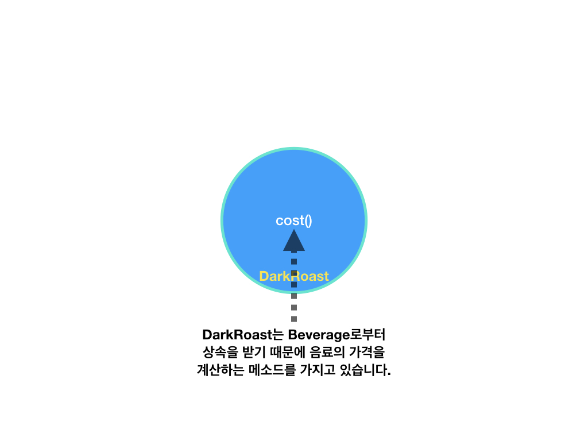
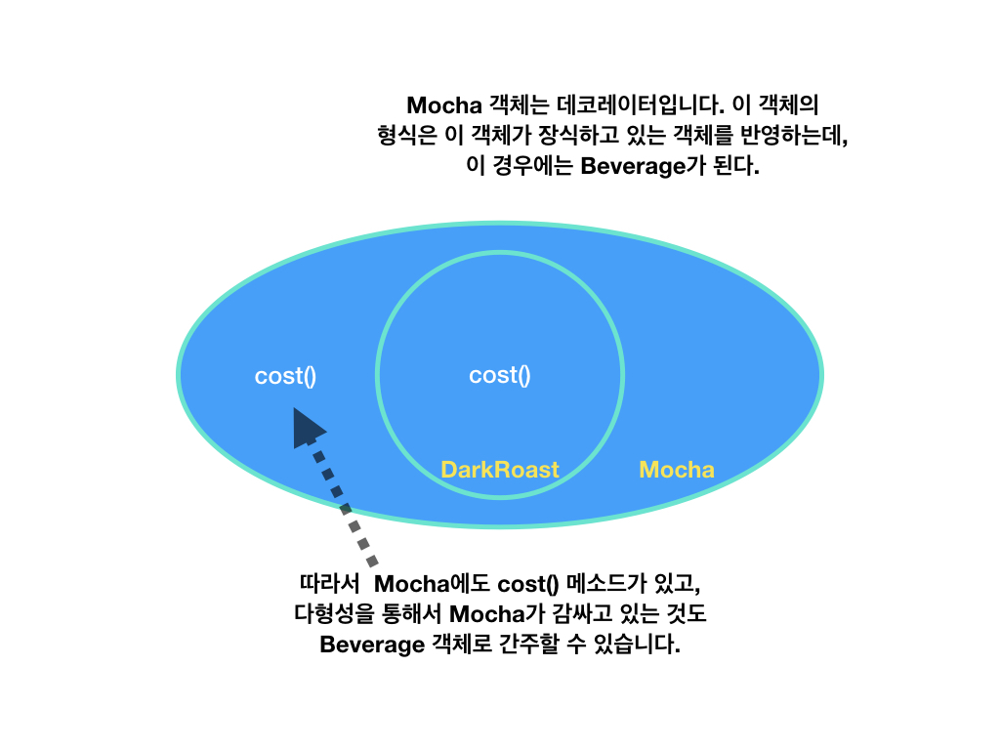
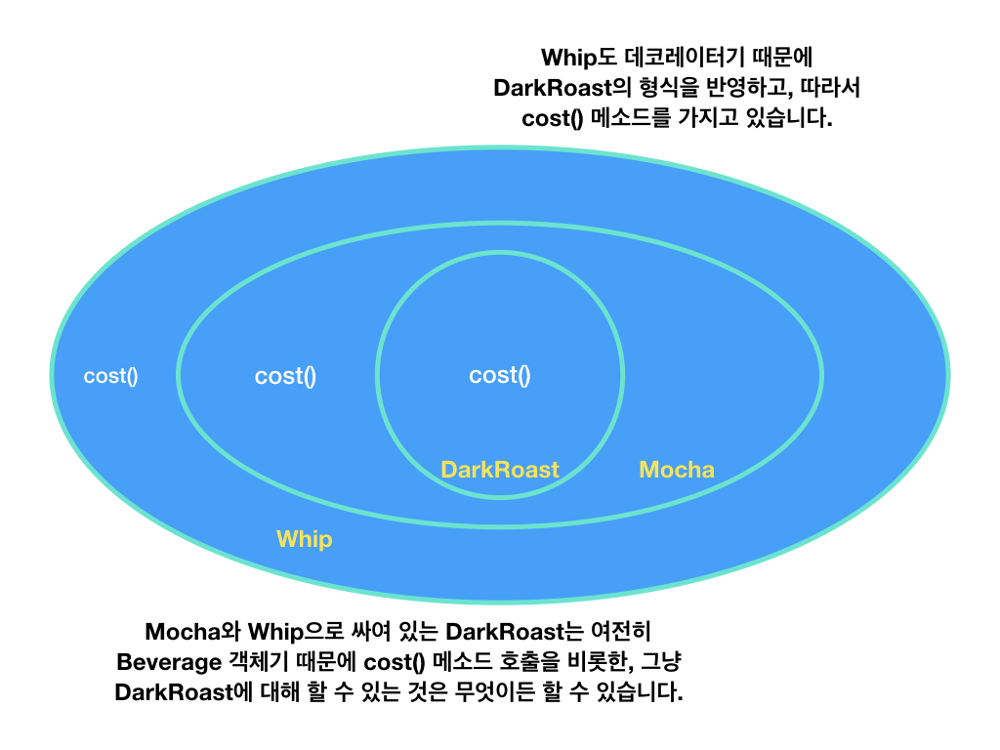
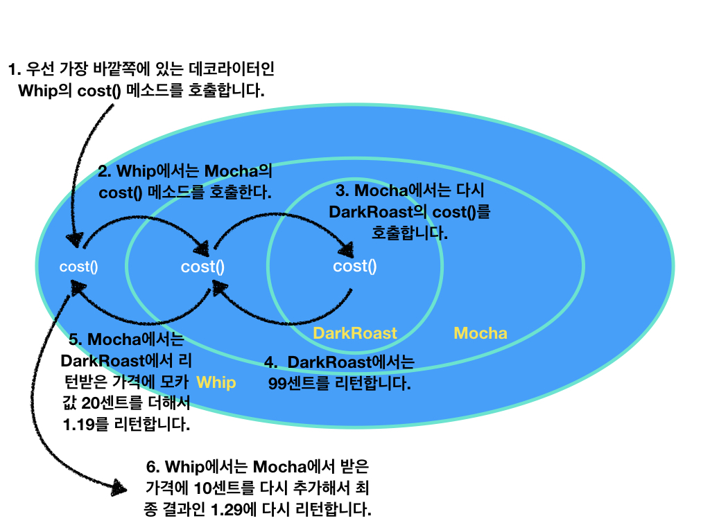

# Decorator Pattern(데코레이터 패턴)

The decorator pattern is a design pattern that allows behavior to be added to an individual object, dynamically, without affecting the behavior of other objects from the same class. The decorator pattern is often useful for adhering to the Single Responsibility Principle, as it allows functionality to be divided between classes with unique areas of concern. The decorator pattern is structurally nearly identical to the chain of responsibility pattern, the difference being that in a chain of responsibility, exactly one of the classes handles the request, while for the decorator, all classes handle the request.

*객체의 결합*을 통해 기능을 동적으로 유연하게 확장 할 수 있게 해주는 패턴이다. 즉, 기본 기능에 추가할 수 있는 기능의 종류가 많은 경우에 각 추가 기능을 Decorator 클래스로 정의한 후 필요한 Decorator 객체를 조합함으로써 추가 기능의 조합을 설계하는 방식이다.

## Decorator Pattern Example(예시) : Beverage

1. Get the DarkRoast object
- DarkRoast 객체를 가져온다.

2. Decorate with Mocha object
- Mocha 객체로 장식한다.

3. Decorate with Whip object
- Whip 객체로 장식한다.

4. Call the cost () method. The calculation of the price of the additive is then delegated to the objects.
- cost() 메소드를 호출한다. 이때 첨가물의 가격을 계산하는 일은 해당 객체들에게 위임된다.

## Implementation(적용)

데코레이터 패턴에서는 객체에 추가적인 요건을 동적으로 첨가한다. 데코레이터는 서브클래스를 만드는 것을 통해서 기능을 유연하게 확장할 수 있는 방법을 제공한다.

### 데코레이터를 써서 음료 주문을 완성하는 방법

1. Start with a DarkRoast object.
- DarkRoast 객체에서 시작합니다.

2. Since the customer ordered mocha, we create a Mocha object and wrap it with DarkRoast.
- 손님이 모카를 주문했으니까 Mocha 객체를 만들고 그 객체로 DarkRoast를 감쌉니다.

3. Since the customer ordered whipped cream as well, they make a Whip decorator and wrap the Mocha with the object.
- 손님이 휘핑 크림도 같이 주문했기 때문에 Whip 데코레이터를 만들고 그 객체로 Mocha를 감쌉니다.

4. Now let's calculate the price When you get a price, the outermost decorator, Whip, delegates the price calculation to the object the object is decorating. After the price is found, the price of the whipped cream is added to the price and the result is returned.
- 이제 가격을 계산해 볼까요? 가격을 구할 때는 가장 바깥쪽에 있는 데코레이터인 Whip에서는 그 객체가 장식하고 있는 객체한테 가격 계산을 위임합니다. 가격이 구해지고 나면, 구해진 가격에 휘핑 크림의 가격을 더한 다음 그 결과를 리턴합니다.

### OCP(Open-Closed Principle)

**Design Principle**
- 클래스는 확장에 대해서는 열려 있어야 하지만 코드 변경에 대해서는 닫혀 있어야 한다.

**OPEN** : 클래스를 확장하고 원하는 행동을 추가가 자유롭다.
**CLOSED** : 더 이상 코드를 수정하지 않는다.

